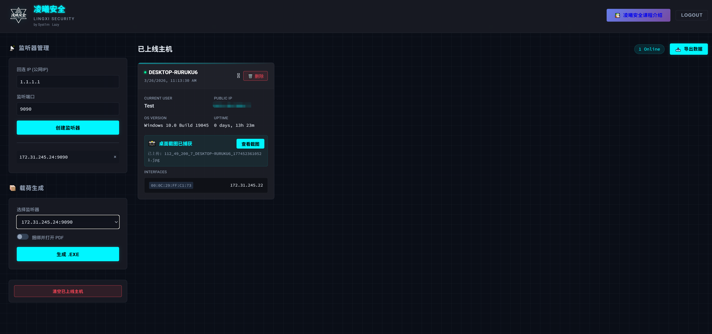

<h1 align="center" >凌曦安全无害化钓鱼演练平台</h1>

<div align="center">

  **凌曦安全无害化钓鱼演练平台**

  [](https://nodejs.org/)
  [](https://www.docker.com/)
  [](LICENSE)
</div>

---

## 目录

- [项目简介](#项目简介)
- [功能特性](#功能特性)
- [快速开始（Docker 部署）](#快速开始docker-部署)
- [手动部署](#手动部署)
- [配置说明](#配置说明)
- [使用指南](#使用指南)
- [配置修改](#配置修改)
- [安全建议](#安全建议)
- [常见问题](#常见问题)
- [免责声明](#免责声明)

---

## 项目简介

**凌曦安全钓鱼演练平台**是一款专为企业安全培训和安全意识演练设计的无**危害化**平台。本平台仅用于合法授权的安全教育和测试，帮助企业评估员工的安全意识水平。



---


## 功能特性

| 功能 | 说明 |
|------|------|
| 无害化演练 | 一键生成Win下的beacon仅采集基础主机信息，不执行破坏性操作，不窃取敏感数据 |
| 实时监控 | 实时显示上线主机信息，按 MAC 去重 |
| 桌面截图 | 自动捕获桌面截图，用于验证演练触达效果 |
| 数据导出 | 一键导出主机信息为 Excel + 截图 ZIP 包，便于生成演练报告 |
| 自定义生成 | 灵活配置回连 IP/端口，自动编译生成演练样本 |
| 多监听器 | 支持同时创建多个 TCP 监听器 |
| 一键清理 | 演练结束后可一键清空所有采集数据及截图 |

### 采集信息

主机名 / 用户名 / 操作系统版本 / 内网 IP / 外网 IP / MAC 地址 / 系统运行时长 / Socket 来源 IP / 桌面截图

---

## 快速开始（Docker 部署）

> 推荐使用 Docker 部署，一条命令即可启动，无需手动安装 Node.js 和 MinGW。

### 前置要求

- [Docker](https://docs.docker.com/get-docker/) 20.10+
- [Docker Compose](https://docs.docker.com/compose/install/) v2+

### 一键启动

```bash
# 克隆项目
git clone https://github.com/lingxisec/LinggxiFish LinggxiFish
cd LinggxiFish

# 启动服务（后台运行）
docker compose up -d
```

启动后访问：

```
http://your-server-ip:8080
```

默认账号：`admin` / 默认密码：`admin`

### 常用 Docker 命令

```bash
# 查看运行状态
docker compose ps

# 查看实时日志
docker compose logs -f

# 停止服务
docker compose down

# 重新构建并启动（代码更新后）
docker compose up -d --build

# 进入容器排查问题
docker compose exec linggxifish sh
```

### 数据持久化

Docker 部署通过 Volume 挂载保证数据不丢失：

| 容器路径 | 说明 |
|---------|------|
| `/app/config.json` | 配置文件（账号密码、端口） |
| `/app/data.json` | 受害者与监听器数据 |
| `/app/screenshots/` | 桌面截图存储 |
| `/app/uploads/` | 上传文件存储 |

即使容器重建，以上数据也会保留。

### 自定义端口

编辑 `docker-compose.yml` 中的 `ports` 映射：

```yaml
ports:
  - "8080:8080"     # Web 管理端口（左侧为宿主机端口）
  - "9090:9090"     # 默认回连端口（按需修改）
```

如果在 Web 界面创建了其他端口的监听器，需要在 `docker-compose.yml` 中添加对应的端口映射并重启容器。

---

## 手动部署

### 系统要求

| 项目 | 要求 |
|------|------|
| 操作系统 | Linux（推荐 Ubuntu 18.04+） |
| Node.js | 14.0+ |
| npm | 6.0+ |
| MinGW-w64 | 用于交叉编译 Windows EXE |
| 内存 | >= 512MB |
| 硬盘 | >= 1GB 可用空间 |

### 安装步骤

```bash
# 1. 安装 MinGW（用于编译 EXE）
apt-get update && apt-get install -y mingw-w64

# 2. 进入项目目录
cd LinggxiFish/linggxi

# 3. 安装依赖
npm install

# 4. 启动服务
node app.js
```

### 生产环境推荐使用 PM2

```bash
npm install -g pm2
pm2 start app.js --name linggxifish
pm2 startup && pm2 save
```

### 防火墙配置

```bash
ufw allow 8080/tcp   # Web 管理端口
ufw allow 9090/tcp   # 回连端口（按实际监听端口开放）
ufw reload
```

---

## 项目结构

```
LinggxiFish/
├── README.md                # 本文件
├── Dockerfile               # Docker 镜像构建
├── docker-compose.yml       # Docker Compose 编排
├── .dockerignore            # Docker 构建忽略规则
└── linggxi/                 # 应用代码
    ├── app.js               # 主入口
    ├── package.json          # 依赖配置
    ├── config.json           # 运行配置
    ├── config.example.json   # 配置示例
    ├── data.json             # 数据存储
    ├── views/                # EJS 页面模板
    │   ├── index.ejs         # 主界面
    │   └── login.ejs         # 登录页
    ├── templates/            # 木马模板
    │   └── beacon.cpp        # C++ 源码模板
    ├── public/               # 静态资源
    ├── screenshots/          # 截图存储
    ├── uploads/              # 上传文件
    └── temp/                 # 编译临时文件
```

---

## 配置说明

 `config.json`：

```json
{
  "admin": {
    "username": "admin",
    "password": "admin"
  },
  "server": {
    "web_port": 8080,
    "listener_port": 9090
  }
}
```

| 字段 | 说明 |
|------|------|
| `admin.username` | Web 登录用户名 |
| `admin.password` | Web 登录密码 |
| `server.web_port` | Web 管理面板端口 |
| `server.listener_port` | 默认回连端口 |

修改配置后需重启服务：

```bash
# Docker 部署
docker compose restart

# PM2 部署
pm2 restart linggxifish
```

---

## 使用指南

### 1. 登录系统

浏览器访问 `http://服务器IP:8080`，阅读并同意免责声明后，输入账号密码登录（默认 `admin` / `admin`）。

### 2. 创建监听器

1. 在首页点击 **"创建监听"** 按钮
2. **回连 IP**：自动填充服务器公网 IP（可手动修改）
3. **回连端口**：默认 9090（可自定义）
4. 点击确认，监听器即刻启动


### 3. 生成样本

1. 填写回连 IP 和端口
2. 可选附加 PDF 文件（生成的 EXE 运行后会自动打开该 PDF）
3. 点击 **"生成并下载EXE"**，浏览器自动下载 `beacon_xxxxx.exe`

### 4. 部署与上线

1. 将生成的 EXE 文件通过邮箱或其他方式发送至目标主机
2. 目标主机运行后，返回 Web 管理界面即可看到上线信息
3. 每台主机以 MAC 地址去重，重复上线会更新信息而非新增

### 5. 查看主机信息

- 主界面实时显示上线主机卡片，包含主机名、用户名、IP、系统版本等
- 点击 **"查看截图"** 可查看该主机的桌面截图
- 点击 **"删除"** 可移除单条主机记录及其截图

### 6. 导出数据

点击 **"导出数据"** 按钮，下载 ZIP 包，包含：
- `victims_data.xlsx`：所有主机信息的 Excel 表格
- `screenshots/`：对应主机的桌面截图文件（命名格式：`IP_主机名_时间戳.jpg`）

### 7. 清空数据

点击 **"清空数据"** 按钮，一键清除所有采集的主机记录和截图文件。

---

## 配置修改

### 修改管理密码

编辑 `config.json`（Docker 部署路径：`./linggxi/config.json`）：

```json
{
  "admin": {
    "username": "admin",
    "password": "your_new_password"
  }
}
```

修改后重启服务：

```bash
# Docker 部署
docker compose restart

# PM2 部署
pm2 restart linggxifish
```

### 修改用户名

同样编辑 `config.json` 中的 `username` 字段：

```json
{
  "admin": {
    "username": "your_username",
    "password": "your_password"
  }
}
```

### 修改 Web 管理端口

编辑 `config.json` 中的 `web_port`：

```json
{
  "server": {
    "web_port": 8888,
    "listener_port": 9090
  }
}
```

> Docker 部署时需同步修改 `docker-compose.yml` 中的端口映射。

### 修改默认回连端口

编辑 `config.json` 中的 `listener_port`：

```json
{
  "server": {
    "web_port": 8080,
    "listener_port": 7777
  }
}
```

> 修改回连端口后需要重新生成演练样本。


### 修改数据存储路径

编辑 `app.js` 文件：
```javascript
// 第21-23行
const DATA_FILE = path.join(__dirname, 'data.json');
const UPLOADS_DIR = path.join(__dirname, 'uploads');
const SCREENSHOTS_DIR = path.join(__dirname, 'screenshots');
```


### 重置配置

如果配置文件损坏或忘记密码：

```bash
# 删除配置文件，重启后自动生成默认配置（admin/admin）
# Docker 部署
docker compose exec linggxifish rm config.json
docker compose restart

# 手动部署
rm linggxi/config.json
pm2 restart linggxifish
```

---

## 安全建议

1. **首次部署后立即修改默认密码**

2. **限制Web管理端口访问**
```bash
# 仅允许特定IP访问8080端口
ufw allow from 192.168.1.0/24 to any port 8080
```


---

## 常见问题

<details>
<summary><b>生成 EXE 失败？</b></summary>

确认已安装 MinGW-w64 交叉编译工具：
```bash
apt-get update && apt-get install -y mingw-w64
```
Docker 部署已内置，无需手动安装。
</details>

<details>
<summary><b>文件运行后在平台无结果？</b></summary>

1. 确认回连端口已开放（防火墙 + 安全组）
2. 确认回连 IP 为服务器公网 IP
3. 确认服务正在运行
4. Docker 部署需确认 `docker-compose.yml` 中映射了对应端口
</details>

<details>
<summary><b>无法访问 Web 管理界面？</b></summary>

1. 确认服务已启动：`docker compose ps` 或 `netstat -tuln | grep 8080`
2. 确认 8080 端口已在防火墙/安全组开放
3. 确认访问的 IP 地址正确
</details>


<details>
<summary><b>Docker 容器中如何添加新的监听端口？</b></summary>

在 `docker-compose.yml` 中添加端口映射后重启：
```bash
docker compose down

# 编辑 docker-compose.yml 添加端口
docker compose up -d
```
</details>


<details>
<summary><b>截图未显示或无法查看？</b></summary>

1. 检查 `screenshots` 目录权限
```bash
chmod 755 /root/Fishing/linggxi/screenshots
```
2. 查看服务器日志

</details>

---

## 免责声明

> **本平台仅供教育和研究使用**，用于企业内部安全培训、安全意识测试等合法授权场景。

1. 使用者必须遵守《中华人民共和国网络安全法》及相关法律法规
2. 严禁用于未经授权的渗透测试、恶意攻击、数据窃取等违法活动
3. 使用本平台必须获得目标对象的明确书面授权
4. 使用者需自行承担一切法律责任，作者概不负责

**下载、安装、使用本平台即表示您已阅读、理解并同意遵守以上所有条款。**

---